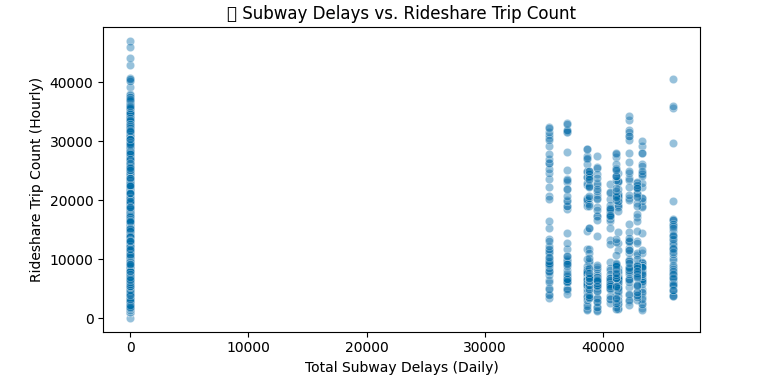
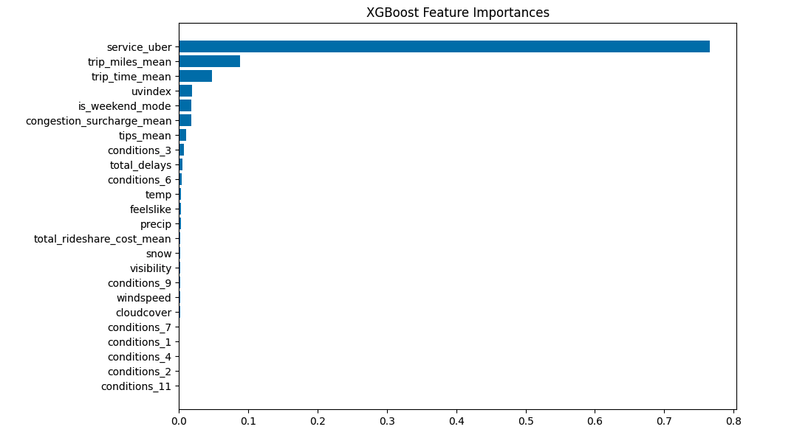
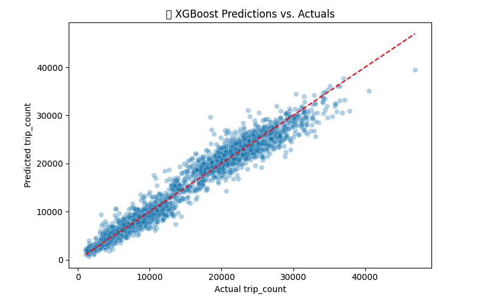
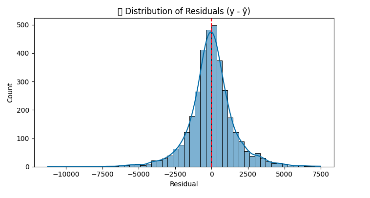
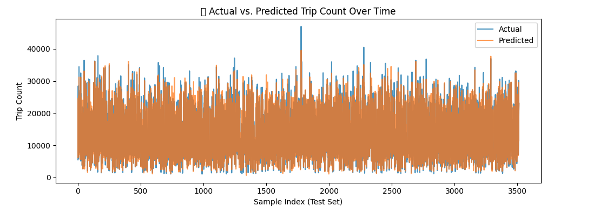
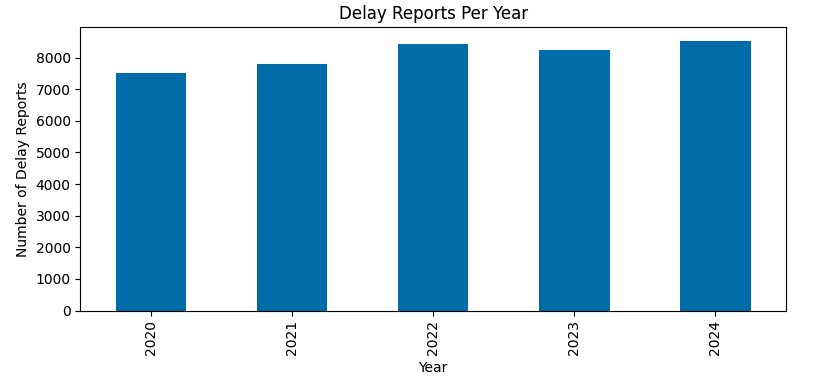

# MTA Delay & Rideshare Demand Prediction

This portfolio-ready data science project applies **machine learning** to model and predict **rideshare demand in New York City** based on **MTA subway delay patterns**. It was developed as a collaborative group assignment for a graduate-level course in data mining and analytics.

---

## Problem Statement
Urban mobility in NYC relies heavily on public transportation. But when the subway system experiences delays, do more people turn to rideshare services like Uber and Lyft?

**Goal:** Use NYC MTA delay data to predict daily rideshare counts and understand how transit disruptions affect alternative transportation demand.

---

## Project Milestones & Key Files

### Checkpoint 1 — [Proposal & Rubric](./checkpoint1/proposal.md)
- [Proposal Rubric](./checkpoint1/proposal_rubric.md)
- Business case & motivation
- Problem framing and ML applicability
- Dataset links and team coordination plan

### Checkpoint 2 — [EDA & Initial Cleaning](./checkpoint2/submission.ipynb)
- Exploratory data analysis
- Preprocessing plans
- Delay category breakdowns
- Initial modeling direction

### Checkpoint 3 — [Checkpoint 3 Rubric](./checkpoint3/checkpoint3_rubric.md)
- Feedback-focused checkpoint
- Guided improvements toward final model

### Final Analysis — [Full EDA + Modeling](./Data%20Processing/mta_delays/MTA_delays_EDA.ipynb)
- Residual analysis
- Actual vs predicted comparison
- Feature importances

---

## Methodology Summary
- **Data Source:** MTA Subway Delays (2020–2025)
- **Target Variable:** Daily rideshare trip counts
- **Features Engineered:**
  - Delay categories
  - Daily total delays
  - External weather data
  - Processed ridership stats
- **Models Used:**
  - Linear Regression
  - Random Forest Regressor
  - XGBoost Regressor

---

## Repository Structure
| Folder/File | Description |
|-------------|-------------|
| [`/checkpoint1`](./checkpoint1) | Proposal documents and rubric |
| [`/checkpoint2`](./checkpoint2) | EDA, preprocessing, and initial modeling plan |
| [`/checkpoint3`](./checkpoint3) | Feedback rubric for final modeling checkpoint |
| [`/Data Processing/mta_delays`](./Data%20Processing/mta_delays) | Jupyter notebooks with cleaning, EDA, modeling |
| [`/final-report`](./final-report) | Final written report & rubric |
| [`/pictures`](./pictures) | Visual output from models & EDA |
| [`README.md`](./README.md) | This file |

---

## Project Visuals
| Screenshot | Description |
|----------------|----------------|
|  | Subway delays vs rideshare activity |
|  | Top predictors (XGBoost) |
|  | Predicted vs Actual comparison |
|  | Model residuals distribution |
|  | Rideshare usage over time |
|  | Delays by year |

---

## Collaborators
This was a collaborative team effort by:
- **Dawryn Rosario** — [@darosari](https://github.com/darosari) *(Data cleaning, regression modeling, EDA, repository setup)*
- **Parker** — [@datawitparker](https://github.com/datawitparker) *(Feature engineering, XGBoost, proposal writing)*
- **Ally** — [@data11y](https://github.com/data11y) *(Data collection, visualization, documentation)*

---

## Final Thoughts
- Demonstrates how public data can inform real-world transportation planning
- Tackles challenges in temporal regression and data quality
- Clean and reproducible code for further experimentation or city-specific analysis

---

**Explore Notebooks:** Just click on any linked file to dive into the code.

**Star this repo** if you found it insightful.
